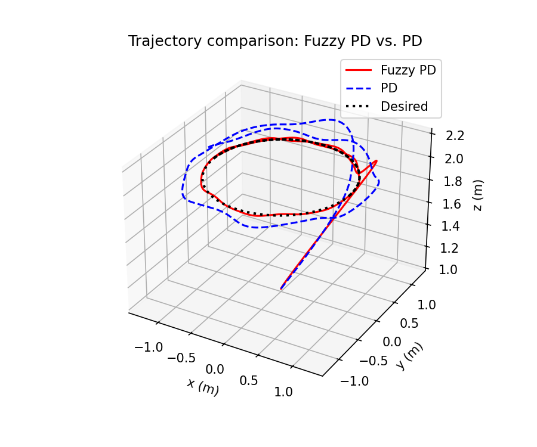
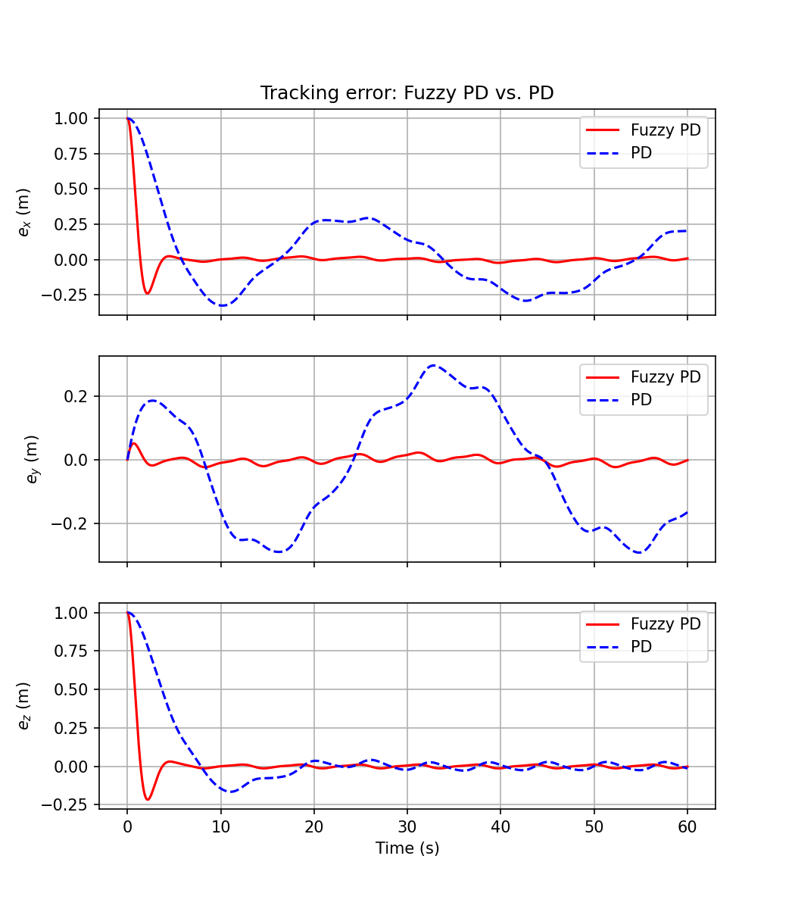

# Fuzzy-PD Quadrotor Controller

Python re-implementation of a Fuzzy-PD trajectory-tracking controller for a
quadrotor UAV.

Two Mamdani fuzzy inference systems (read directly from the original `.fis`
rule files) tune the position-loop $K_p, K_d$ gains online, based on the
tracking error and its derivative.

| Trajectory (Fuzzy-PD vs. PD) | Tracking error $e_x, e_y, e_z$ |
|---|---|
|  |  |

## Files

- `fis_reader.py` — Mamdani FIS reader/evaluator (parses `.fis` files, no
  hand-copied rules).
- `quadrotor_fuzzy_pd.py` — closed-loop simulation (6-DOF dynamics + Fuzzy-PD
  position loop + fixed-gain PD attitude loop).
- `compare_pd_fuzzypd.py` — Fuzzy-PD vs. fixed-gain PD comparison (trajectory,
  error, RMSE/MAE).
- `full_report_simulations.py` — extended version: position/attitude
  responses, online gain adaptation, and a 3x-disturbance robustness test.
- `delKp.fis`, `delKd.fis` — original fuzzy rule bases.
- `FuzzyPDController.m` — original MATLAB source (reference).
- `outputs/` — generated figures and metrics.

## Usage

```bash
pip install -r requirements.txt

python quadrotor_fuzzy_pd.py          # basic Fuzzy-PD simulation
python compare_pd_fuzzypd.py          # Fuzzy-PD vs. PD comparison
python full_report_simulations.py     # full set of results
```

## Notes

- `solve_ivp(method='RK45')` replaces MATLAB's `ode45` (same tolerances).
- Two intentional fixes vs. the original `.m` script: the position/attitude
  disturbance terms were swapped in the original (no numeric effect, fixed
  for clarity), and the derivative filter constant was renamed `tau_diff`
  (it's a fixed-rate "dirty derivative" filter, deliberately independent of
  the ODE solver's step size).
- Fuzzy-PD cuts tracking RMSE by ~49-90% vs. fixed-gain PD, and stays 2-8x
  more accurate even under 3x the disturbance — at the cost of larger
  roll/pitch oscillation during the transient (see `outputs/`).
